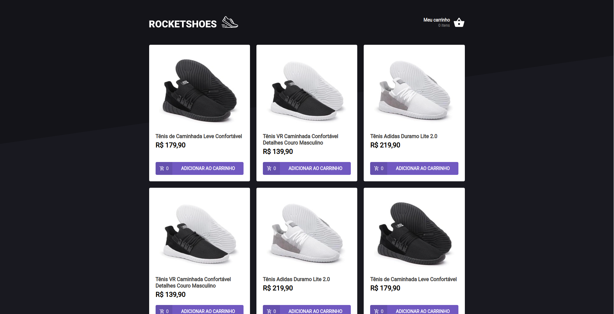
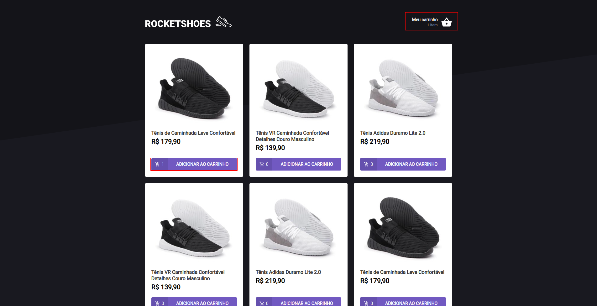
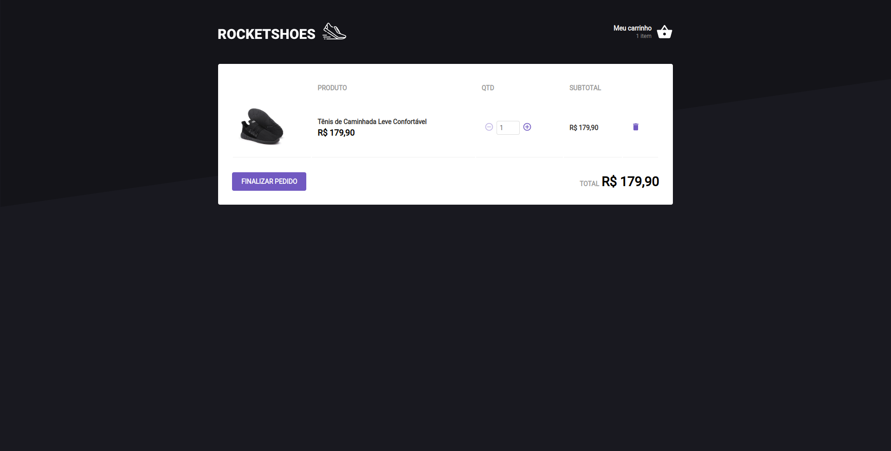
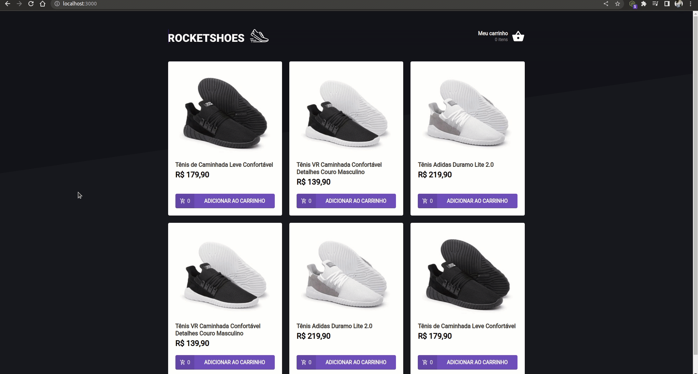

<p align="center">
  
  <br>
</p>
<h3 align="center">
  Você bem da cabeça aos pés!
</h3>

<br><br>

<p align="center">
  
  
  
  
</p>
<br>

<p align="center">
  <a href="#sobre">Sobre</a> •
  <a href="#rocketShoes">RocketShoes</a> •
  <a href="#instalação">Instalação</a> •
  <a href="#tecnologias">Tecnologias</a> •
  <a href="#autor">Autor</a>  
</p>

<br>

## Sobre

Projeto desenvolvido para o desafio 3 do bootcamp Ignite da RocketSeat na trilha de ReactJS cujo objetivo foi implementar o fluxo de carrinho de compras para fixar conceitos como estado, hooks e contextos.

## RocketShoes

A RocketShoes é uma aplicação web construída em ReactJS que visa implementar o fluxo de carrinho de compras. A aplicação é bem simples e a página inicial, conforme veremos a seguir, mostrará os dados dos produtos em formato de lista e a opção de adicionar o item no carrinho, o qual é exibido no canto superior direito da tela:



Após clicar em **Adicionar ao carrinho**, o item em questão será adicionado na lista de compras do usuário e o status do carrinho será persistido no navegador e exibido no canto da tela, conforme marcação abaixo:



No botão que exibe o status do carrinho podemos consultar quais e quantos itens foram adicionados, além é claro, de conceder ao usuário a liberdade de alterar quantidade e remover itens da compra antes de finaliza-la, como exemplificado abaixo:



Deixo a seguir um GIF para ilustrar o funcionamento da aplicação, mostrando os fluxos possíveis e o comportamento da interface diante das ações do usuário:



## Instalação

Antes de começar, você vai precisar ter instalado em sua máquina as seguintes ferramentas:
[Git](https://git-scm.com), [Node.js](https://nodejs.org/en/).
Além disto é bom ter um editor para trabalhar com o código como [VSCode](https://code.visualstudio.com/).

### 🖥️ Rodando a aplicação

```bash
# Clone este repositório
$ git@github.com:MrRioja/rocketshoes.git

# Acesse a pasta do projeto no terminal/cmd
$ cd rocketshoes

# Instale as dependências
$ npm install
# Caso prefira usar o Yarn execute o comando abaixo
$ yarn

# Execute a API feita com JSON server
$ npm run server
# Caso prefira usar o Yarn execute o comando abaixo
$ yarn server

# Execute a aplicação em modo de desenvolvimento
$ npm run start
# Caso prefira usar o Yarn execute o comando abaixo
$ yarn start

# O servidor inciará na porta 3000 - acesse <http://localhost:3000>
```

## Tecnologias


<br><br><br><br>

## Autor

<div align="center">

<h1>Luiz Rioja</h1>
<strong>Backend Developer</strong>
<br/>
<br/>

<a href="https://linkedin.com/in/luizrioja" target="_blank">

</a>

<a href="https://github.com/mrrioja" target="_blank">

</a>

<a href="mailto:lulyrioja@gmail.com?subject=Fala%20Dev" target="_blank">

</a>

<a href="https://api.whatsapp.com/send?phone=5511933572652" target="_blank">

</a>

<a href="https://join.skype.com/invite/tvBbOq03j5Uu" target="_blank">

</a>

<br/>
<br/>
</div>
